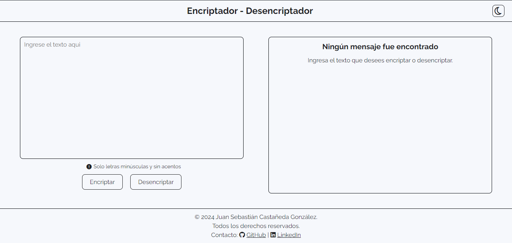
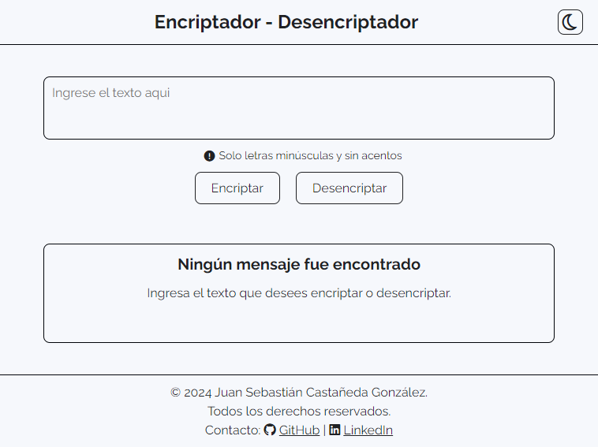
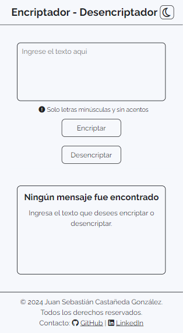
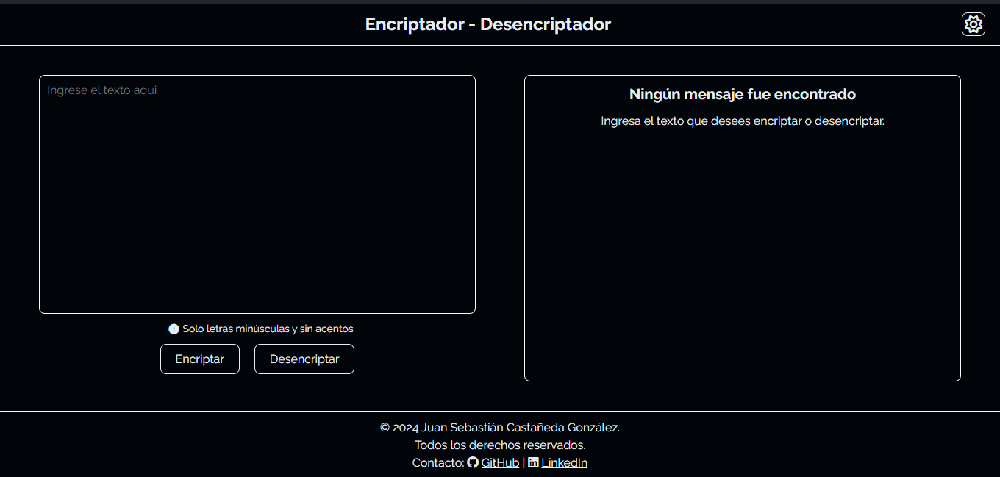
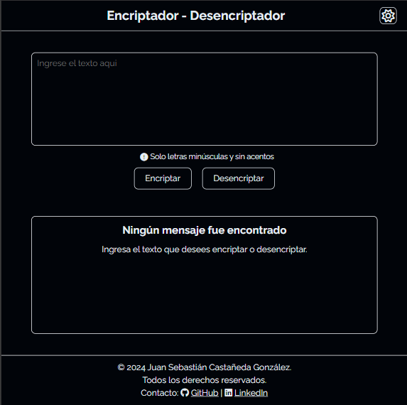
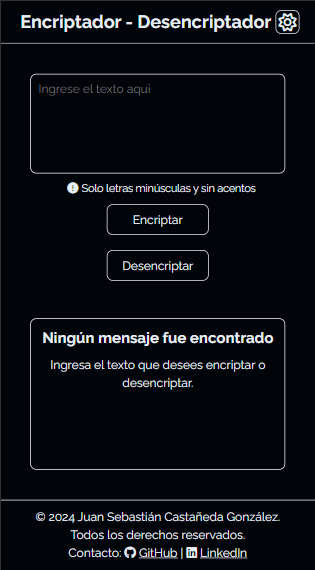

# Encriptador - Desencriptador

Este proyecto es una aplicación web que permite encriptar y desencriptar texto utilizando un método de sustitución. La aplicación está diseñada para aceptar solo letras minúsculas y números, y cuenta con una funcionalidad de cambio de tema entre modo claro y oscuro.

## Características

- Encriptación y desencriptación de texto.
- Interfaz amigable y fácil de usar.
- Modo claro y oscuro para mayor comodidad visual.
- Copia de texto encriptado al portapapeles.

## Tecnologías Utilizadas

- HTML
- CSS
- JavaScript
- Font Awesome para iconos
- Google Fonts para tipografía

## Instalación

1. Clona el repositorio:

```
   git clone https://github.com/sebascasta14/encrypt.git
```

2. Navega al directorio del proyecto:

```
   cd encriptador
```

3. Abre el archivo `index.html` en tu navegador.

## USO

1. Ingresa el texto que deseas encriptar en el área de texto.
2. Haz clic en el botón "Encriptar" para obtener el texto encriptado.
3. Para desencriptar, ingresa el texto encriptado y haz clic en "Desencriptar".
4. Utiliza el botón "Copiar" para copiar el texto resultante al portapapeles.

## Capturas de Pantalla

### Modo Claro





### Modo Oscuro





## Licencia

Este proyecto está bajo la Licencia MIT.

## Contacto

Para consultas o sugerencias, puedes contactarme en:

GitHub: [sebascasta14](https://github.com/sebascasta14)
LinkedIn: [Sebastian Castaneda](https://www.linkedin.com/in/sebastian-castaneda-27564b236/)
